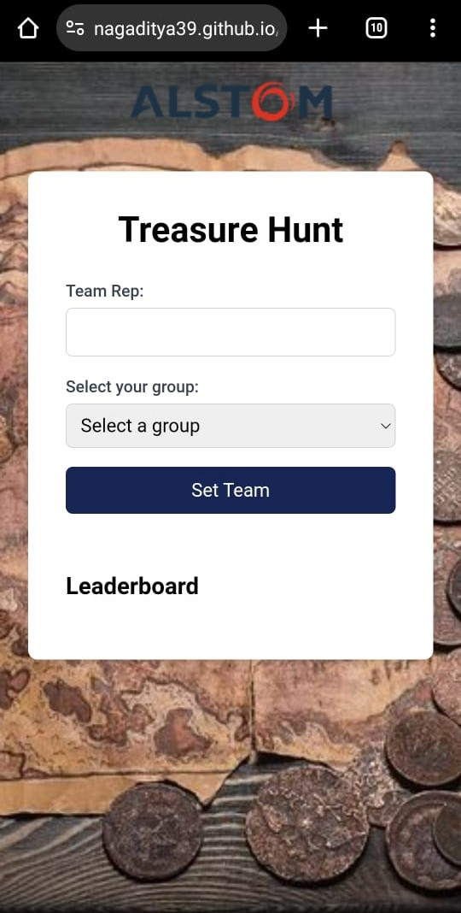

# 🗺️ Scavenger Hunt Frontend

<div align="center">


[](https://reactjs.org/)
[](https://axios-http.com/)
[](https://tailwindcss.com/)

An interactive web-based treasure hunt application.

[Features](#-features) • [Setup](#%EF%B8%8F-setup-and-installation) • [Usage](#-usage) • [Deployment](#-deployment) • [Contributing](#-contributing)
</div>

This is the frontend repository for the Scavenger Hunt application. For the backend code, please visit the [Scavenger Hunt Backend Repository](https://github.com/nagaditya39/scavenger_hunt_backend).

## 🌟 Features

- 🏷️ Team registration with group selection
- 🔑 Code submission and validation
- 🏆 Real-time leaderboard
- 📊 Progress tracking
- 🎉 Winning condition and final position display

## 🛠️ Setup and Installation

1. **Clone the repository**
   ```bash
   git clone https://github.com/yourusername/scavenger_hunt.git
   cd scavenger_hunt
   ```

2. **Install dependencies**
   ```bash
   npm install
   ```

3. **Environment Configuration**
   Create a `.env` file in the root directory:
   ```env
   REACT_APP_API_URL=https://your-backend-url.com/api
   ```

4. **Start the development server**
   ```bash
   npm start
   ```
   The application will be available at `http://localhost:3000`.

## 🎮 Usage

1. Open the application in a web browser.
2. Enter your team name and select your group.
3. As you progress through the treasure hunt:
   - Submit codes as you find them.
   - View your progress on the dashboard.
   - Check the leaderboard to see how your team ranks.
4. Complete all clues to finish the game and see your final position!

## 🚀 Deployment

This application is optimized for deployment on GitHub Pages.

1. Update the `homepage` field in `package.json`:
   ```json
   "homepage": "https://yourusername.github.io/scavenger_hunt"
   ```

2. Build the project:
   ```bash
   npm run build
   ```

3. Deploy to GitHub Pages:
   ```bash
   npm run deploy
   ```

## 🧩 Project Structure

```
scavenger_hunt/
│
├── public/
│   ├── index.html
│   └── org.png
│
├── src/
│   ├── App.js
│   ├── index.js
│   └── index.css
│
├── package.json
├── README.md
└── .gitignore
```

## 🤝 Contributing

Contributions are always welcome! Here's how you can help:

1. Fork the repository.
2. Create a new branch: `git checkout -b feature-branch-name`.
3. Make your changes and commit them: `git commit -m 'Add some feature'`.
4. Push to the branch: `git push origin feature-branch-name`.
5. Submit a pull request.

Please make sure to update tests as appropriate and adhere to the existing coding style.

## 🙏 Acknowledgements

- [React](https://reactjs.org/) for the powerful front-end framework.
- [Axios](https://axios-http.com/) for simplified HTTP requests.
- [Tailwind CSS](https://tailwindcss.com/) for the sleek, responsive design.

---

<div align="center">
<br>
  Made by <strong>Aditya Nag</strong>
</div>
